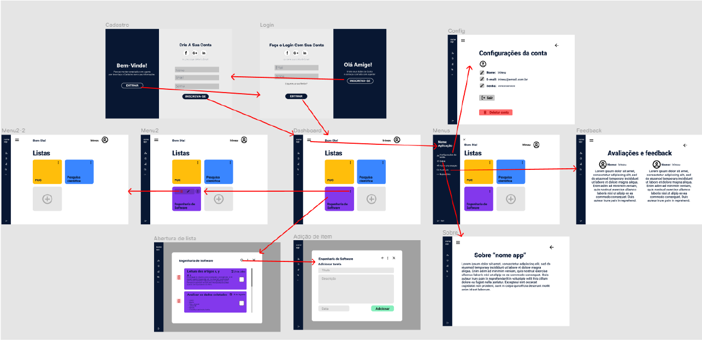
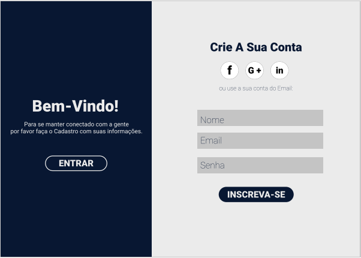
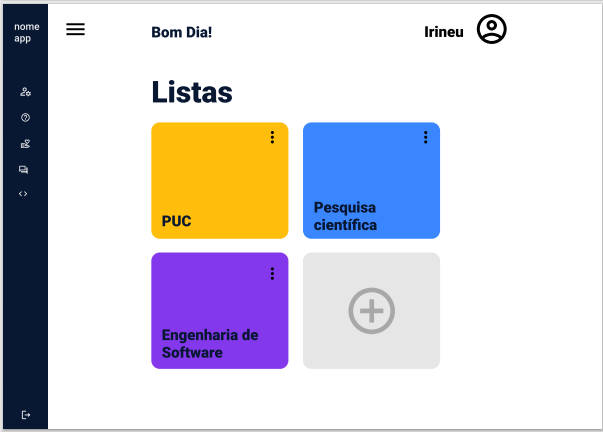
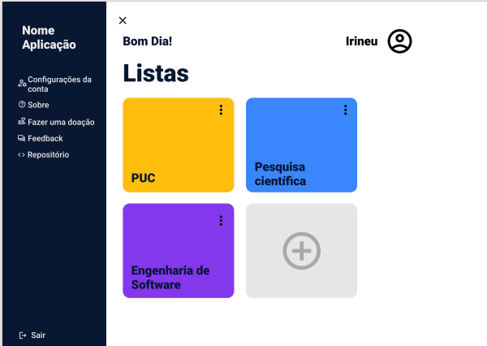
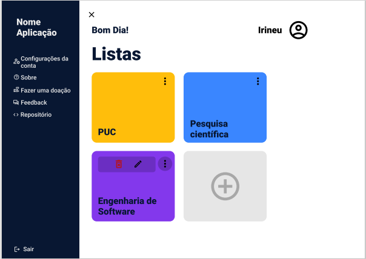
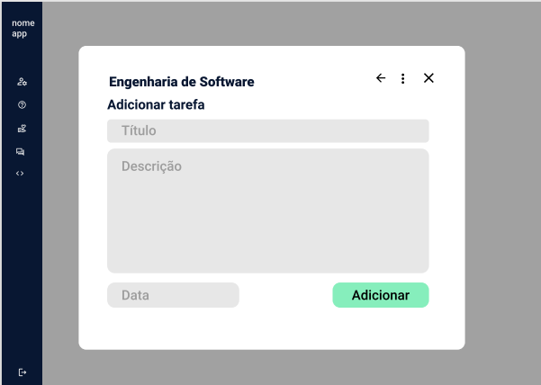
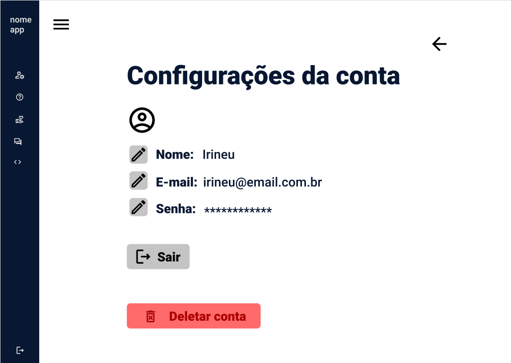
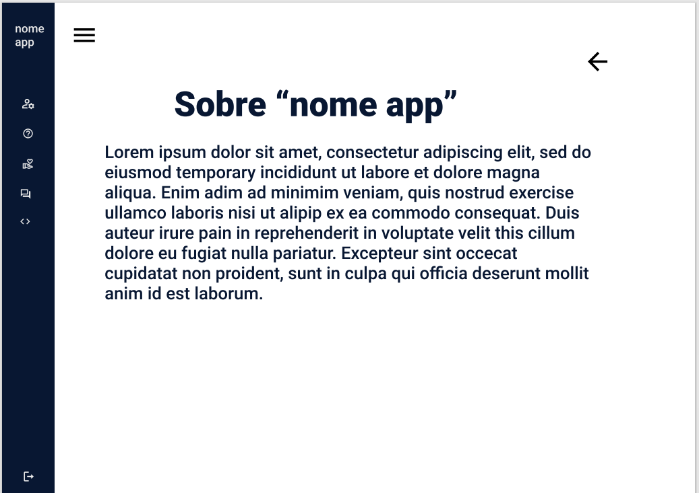

# Projeto de Interface

Dentre as preocupações para a montagem da interface do sistema, estamos
estabelecendo foco em questões como agilidade, acessibilidade e usabilidade. Desta
forma, o projeto tem uma identidade visual padronizada em todas as telas que são
projetadas para funcionamento em desktops e dispositivos móveis.

## User Flow

## Wireframes

