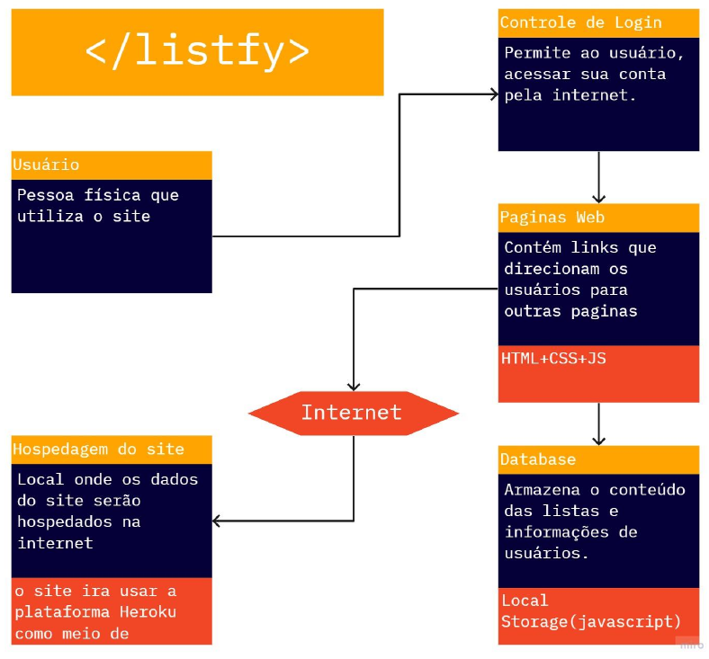

# Projeto da Solução

## Tecnologias Utilizadas
Serão utilizadas tecnologias padõres da web como HTML, CSS e JavaScript.
Além disso, são utilizadas praticas de modularização de arquivos css e bibliotecas de javascript de geração de hashes e salvamento de arquivos. [Artefatos: gerador.js e FileSaver.js];
## Arquitetura da solução
### Diagrama de Componentes

### User Flow

